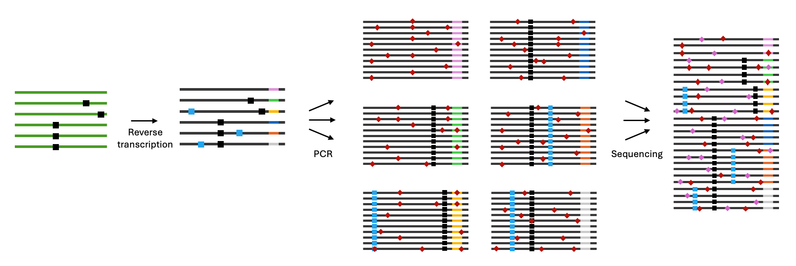

<h1 align="center">shUMI</h1>

_shUMI_ – <b>S</b>imulating <b>H</b>igh-throughput <b>UMI</b>-based single-genome amplification and sequencing data.



shUMI generates sequencing data (raw PacBio CCS) from simulated high-throughput single-genome amplification and sequencing (HT-SGS) experiments. It allows for simulated experiments on arbitrary virus populations and detailed control of sample and library preparation variables, including cDNA copies loaded into PCR, reverse transcription (RT) and PCR error rates, PCR cycle count, RT and PCR recombination rates, sequencing movie time, and number of acquired sequencing reads.

# Requirements

- [python](https://www.python.org/downloads/) 3.10 or newer
- [pbsim3](https://github.com/yukiteruono/pbsim3)
- [pbccs](https://ccs.how) (not needed for generating subreads only)
- [seqkit](https://github.com/shenwei356/seqkit)
- [samtools](http://www.htslib.org)


# Installation

Install `shumi` as a Python package to easily use on the command line.

```
pip install .  # Installs necessary Python packages
shumi -v  # Verify installation was successful by printing version
```

# Usage

```
shumi [--input-seq path | --input-pop path | --random L] <--ncdna n> <--rtp ACGTN...> <--reads m> [-h] [options]
```

**Required arguments**: 
- A virus population specification via `--input-seq`, `--input-pop`, or `--random` (see below for more details)
- `--ncdna n` (number of cDNA loaded into PCR)
- `--rtp [ACTGN...]` (RT-UMI primer sequence)
- `--reads m` (number of CCS reads to generate)

**Virus population specification**:

SHUMI supports virus population definition via three routes: an input sequence (via `--input-seq`), an input population (via `--input-pop`), or a random sequence with a defined length (via `--random L`). One of these flags must be provided to describe the source RNA sequences used in the simulated experiment.

Importantly, in all cases, the "population" being described is a collection of _amplicon_ sequences – i.e., the haplotypes that exist within the target amplicon region (between the PCR forward primer and the RT-UMI primer), not the entire virus genome. See example files in `seqs/`.

- Use `--input-seq path` to provide a single sequence in FASTA format. Use in conjuction with `--clonal` to simulate a clonal RNA population or use in conjunction with `--dirichlet [alpha]` and `--nhaps [h]` to simulate a population with diversity following a Dirichlet distribution with `alpha` concentration parameter and `h` total haplotypes.
- Use `--input-pop path` to provide a reference population in FASTA format. _The sequences must be aligned_. During RT, sequences will be uniformly randomly sampled from the file, so the relative abundance of haplotypes can be controlled by repetitively including the same sequences in concordance to their desired abundance (e.g., provide 9x haplotype A and 1x haplotype B to simulate a population of 90% A and 10% B). `--input-pop` is not compatible with `--dirichlet`, `--nhaps`, or `--clonal`.
- Use `--random L` to generate a random sequence of length `L` to use for simulations. Can be used in conjuction to `--clonal`, `--dirichlet`, and `--nhaps` analogously to `--input-seq`.

**Primary options**:

- Use `--ncdna [n]` to specify the number of first-copy cDNA loaded into PCR.
- The RT-UMI primer scheme can be provided via `--rtp [ACGTN...]`. When generating first-copy cDNA with UMI sequences, N's will be replaced by random bases.
- Use `--reads [m]` to specify the number of final CCS reads.
- Use `--cycles [k]` to specify the number of PCR cycles (default: 30).
- Use `--pcr-efficiency [q]` to specify PCR efficiency. `q` is the probability that a molecule is copied during a given cycle.
- Use `--error-rate-rt/--error-rate-pcr` to specify the per-base error rate when copying molecules during RT/PCR (defaults: 1 x 10⁻⁴ for RT, 2.6 x 10⁻⁵ for PCR).
- Use `--recomb-rate-rt/--recomb-rate-pcr` to specify the per-copy recombination rate when copying molecules during RT/PCR (defaults: 0.0 for RT, 0.0001 for PCR).

**Configuration files**:

Command line arguments can be combined and provided a configuration file in YAML format via the `--config` flag. If an argument is included in both the configuration file and on the command line, command line arguments will override the contents of the configuration file. See [sars2spike_B_2R.yaml](config/sars2spike_B_2R.yaml) for an example configuration file.


**Examples**:

Generate 1000 reads from a HT-SGS experiment on a clonal SARS-CoV-2 spike population, loading 50 cDNA into PCR:

```bash
shumi --input-seq seqs/sars-cov-2-spike-amplicon.fasta \
  --clonal \
  --ncdna 50 \
  --rtp TTGTTCGCGCTACTGCAACGNNNNNNNNATAATTCAGGAGGCCACGCGGG \
  --fp GCATGCAAATTACATATTTTGGAGGAATAC \
  --reads 1000 
```

Generate 100,000 reads from a HT-SGS experiment on a low-diversity SARS-CoV-2 S-E-M population, loading 1000 cDNA into PCR:

```bash
shumi --input-seq seqs/sars-cov-2-sem-amplicon.fasta \
  --dirichlet 0.05 --nhaps 10 \
  --ncdna 1000 \
  --rtp AGATGAAGAGCAACCAATGGAGANNNNNNNNATAATTCAGGAGGCCACGCGGGTATAGTGAGTCGTCGGACGGAGCGG \
  --fp TTCGCATGGTGGACAGCCTTTGTT \
  --reads 100000 
```


# Outputs

The following outputs are always produced:
- Underlying RNA sequences: `[output folder]/[run name]-rna.fasta`
- First-copy cDNA sequences: `[output folder]/[run name]-fccdna.fasta`
- Sampled PCR-amplified DNA sequences:  `[output folder]/[run name]-pcrdna.fasta`
- Simulated subreads: `[output folder]/[run name].subreads.bam`
- Simulated CCS reads: `[output folder]/[run name].ccs.fastq.gz`
- Histograms of sampled molecules per UMI family: `[output folder]/[run name]-samples.png`


# Additional options

Run `shumi -h` for a full list of available options.

# Citation

Citation TBA.

## Notes

- Use `--rng [digits]` to generate a fully reproducible run.
- Primer sequences can contain ambiguous bases according to standard IUPAC codes. Nucleotides are randomly sampled from the degenerate bases when primers are first attached to a molecule. 
- Use `--threads [t]` to control the maximum allowed number of threads. SHUMI is parallelized at most steps.
- UMI schemes which cannot be written as equimolar random bases (i.e., runs of N's) can be provided via a file of allowed UMI sequences via the `--umis [path]` argument.
- Because we cannot know which simulated ZMWs will produce data sufficient for CCS generation before generating CCS, the simulator samples extra molecules for sequencing before generating CCS with `ccs`. The factor used when producing subreads can be provided with `--overhead [u]` and by default is 1.5. In some cases, this factor may need to be increased in order to produce the required number of reads requested with `--reads [m]`.
- The `ccs` command is not available for non-Linux systems. Users running SHUMI on non-Linux systems will see warnings that CCS generation is skipped; however, subreads will still be produced and these data can be transferred to a Linux system to generate CCS via `ccs`, if desired.
